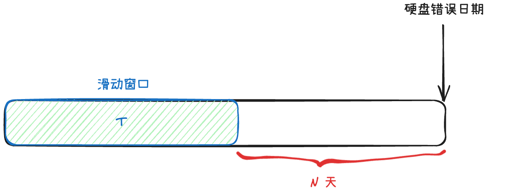

# AI4Storage
AI For Storage, including drive failure prediction and fault recovery.

```
.
├── data_process # 数据预处理文件夹
│   ├── data_preprocess.ipynb
│   ├── preprocess_all_smart_norm.py
│   ├── preprocess_raw.py
│   ├── preprocess_v2.py
│   └── Untitled.ipynb
├── datasets # 已经处理好的文件
│   └── raw_10ahead_10window
├── models # 模型集合
│   ├── lstm.ipynb
│   └── svm.ipynb
└── README.md
```
# 数据集说明
目前raw_10head_10window保存了从2018年1月22日的数据，以ssd_failure_label.csv中的数据为基准，首先按照时间升序排序，依次遍历。找到错误日期前20天的数据，将窗口大小设置为10，每次滑动5天，标签设置为10天内硬盘是否会发生错误


使用到的SMART编号为1, 9, 12, 171, 173, 174, 183, 187, 188, 194, 195, 198

| ID   | 属性                        | 英文说明                           | 中文说明                                   |
|------|-----------------------------|-------------------------------------|------------------------------------------|
| 1    | Read Error Rate             | Frequency of read errors           | 读取错误率，表示磁盘读取数据时的错误频率。 |
| 9    | Power-On Hours              | Total hours the disk is powered on | 通电时间，表示磁盘累计通电的时间。         |
| 12   | Power Cycle Count           | Count of power on/off cycles       | 通电次数，表示磁盘的开关机次数。           |
| 171  | SSD Program Fail Count      | Failed program operations          | SSD程序失败计数，表示SSD编程操作的失败次数。|
| 173  | SSD Wear Leveling Count     | Wear leveling operations           | SSD均衡计数，表示SSD的磨损均衡操作次数。   |
| 174  | Unexpected Power Loss Count | Unexpected power losses            | 意外断电计数，表示磁盘意外断电的次数。     |
| 183  | SATA Downshift Error Count  | Interface downshift errors         | SATA接口降速错误计数，表示因错误导致接口降速的次数。 |
| 187  | Uncorrectable Errors        | Errors that could not be corrected | 不可修复错误，表示无法修正的数据错误次数。 |
| 188  | Command Timeout             | Timeout errors                     | 命令超时计数，表示执行命令超时的次数。     |
| 194  | Temperature                 | Current temperature                | 温度，表示磁盘当前的工作温度。             |
| 195  | Hardware ECC Recovered      | Corrected errors via ECC           | 硬件ECC纠正计数，表示通过硬件ECC纠正的错误次数。 |
| 198  | Uncorrectable Sector Count  | Sectors with uncorrectable errors  | 不可修复扇区计数，表示存在不可修复错误的扇区数量。 |

数据格式：total_data.append({'disk_id': disk_id, 'model': model, 'data': serialized_data, 'label': 0})


# 结果说明

使用raw_10head_10window

模型：SVM
结果：
```
Test set label counts - 0: 4100, 1: 1901
Accuracy: 0.8363606065655724
Classification Report:
               precision    recall  f1-score   support

           0       0.82      0.98      0.89      4100
           1       0.92      0.53      0.67      1901

    accuracy                           0.84      6001
   macro avg       0.87      0.75      0.78      6001
weighted avg       0.85      0.84      0.82      6001

TPR (True Positive Rate): 0.53
FPR (False Positive Rate): 0.02
F1-score: 0.67
AUC score: 0.85
```

TODO
===

测试数据应该要如下图所示：


- [ ] 使用N=30天的SMART数据进行测试
- [ ] 数据格式加入n_further_days，表示还有N天硬盘出现错误，如果该硬盘不会出现错误，则=-1
