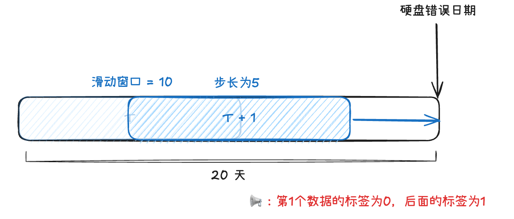

# AI4Storage
AI For Storage, including drive failure prediction and fault recovery.

```
.
├── data_process # 数据预处理文件夹
│   ├── data_preprocess.ipynb
│   ├── preprocess_all_smart_norm.py
│   ├── preprocess_raw.py
│   ├── preprocess_v2.py
│   └── Untitled.ipynb
├── datasets # 已经处理好的文件
│   └── raw_10ahead_10window
├── models # 模型集合
│   ├── lstm.ipynb
│   └── svm.ipynb
└── README.md
```
# 数据集说明
目前raw_10head_10window保存了从2018年1月22日的数据，以ssd_failure_label.csv中的数据为基准，首先按照时间升序排序，依次遍历。找到错误日期前20天的数据，将窗口大小设置为10，每次滑动5天，标签设置为10天内硬盘是否会发生错误



# 结果说明

使用raw_10head_10window

模型：SVM
结果：
```
Test set label counts - 0: 4100, 1: 1901
Accuracy: 0.8363606065655724
Classification Report:
               precision    recall  f1-score   support

           0       0.82      0.98      0.89      4100
           1       0.92      0.53      0.67      1901

    accuracy                           0.84      6001
   macro avg       0.87      0.75      0.78      6001
weighted avg       0.85      0.84      0.82      6001

TPR (True Positive Rate): 0.53
FPR (False Positive Rate): 0.02
F1-score: 0.67
AUC score: 0.85
```
